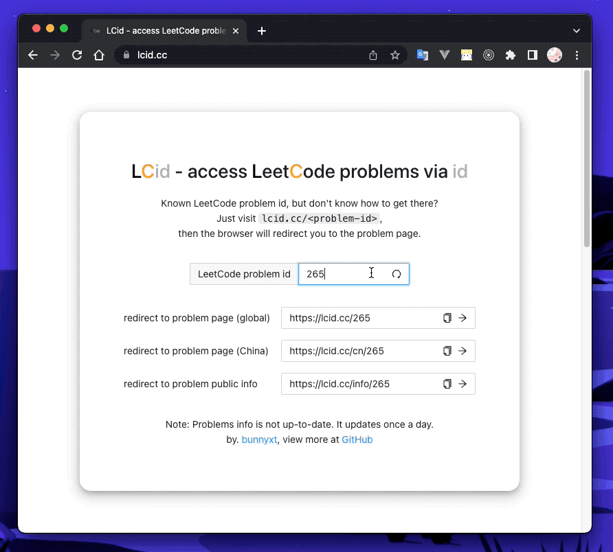

# LCid - access LeetCode problems via id

## Introduction

As a world's leading online programming learning platform, [LeetCode](https://leetcode.com) is quite popular among programmers. Since each problem has a unique number id, users tend to share problems via id. However, it is not convenient to visit problem page **directly via id**. People have to visit [LeetCode Problems](https://leetcode.com/problemset/all/) firstly, then enter that number id in the 'Search questions' input box, press 'enter', click the problem title link, finally comes to the problem page. What a hard work!

This simple project, called LCid, provides directly access to LeetCode problems via id. Features:

- Fetch all LeetCode problems via crawler.
- Redirect to LeetCode problem page with problem id in the URL path via backend.
- Support both LeetCode [global site](https://leetcode.com/problemset/all/) and [China site](https://leetcode-cn.com/problemset/all/) redirect.
- CI/CD, fetch all LeetCode problems daily and commit back to repository via GitHub Actions, then trigger backend rebuild and redeploy with the latest problems via Heroku.



LCid is now available at [lcid.cc](https://lcid.cc). Just add `/<problem-id>` at the end of `lcid.cc` (e.g. [lcid.cc/1](https://lcid.cc/1)), then browser will redirect you to the problem page. Simple, fast, and make your live easier.

What's more, to redirect to China site, add `/cn/<problem-id>` instead (e.g. [lcid.cc/cn/1](https://lcid.cc/cn/1)). Interested in the brief info of the problem? Try `/info/<problem-id>` (e.g. [lcid.cc/info/1](https://lcid.cc/info/1)) and find more!

<!-- More technical details introduced at [this blog](https://www.bunnyxt.com/blogs/lcid-cc-leetcode-problems-redirect-via-id/) (Chinese only). -->

## Environment

To start LCid on your local machine, you should have `python 3.7+` installed.

The crawler is implemented with `urllib3` and backend is powered with `flask`.

To install all those dependencies, execute `pip install -r requirements`.

The frontend is built with `React.js` with `Ant Design` UI.

To build frontend, you should have `Node.js 16.13.2+` with `npm 8.1.2+` installed.

(older versions may work but not tested)

## Usage

### Set environment

Updated Oct 29 2023, leetcode.com now protected with Cloudflare. To send request to any page or endpoint under leetcode.com, `cf_clearance` and `csrftoken` are required.

For now, it is difficult to automate way to get both `cf_clearance` and `csrftoken`. Therefore, it is okay to manually get from browser for now.

Once we fetched `cf_clearance` and `csrftoken` from browser, copy file `.env` to `.env.local`, fill both fields accordingly.

```
REACT_APP_BACKEND_API_URL="http://localhost:1437"
LC_CF_CLEARANCE="{manually get from browser}"
LC_CSRFTOKEN="{manually get from browser}"
```

### Fetch All Problems

To fetch all problems, execute `python fetch_problems_all.py`. Then, you will see the logs below.

```zsh
Now try get csrftoken...
Got csrftoken fakecsrftokenfakecsrftokenfakecsrftokenfakecsrftokenfakecsrftoke.
Found 2060 problems in total.
Now try fetch all 2060 LeetCode problems...
All 2060 problems fetched.
All 2060 problems info saved into problems_all.json file.
```

After few seconds, all problems info have been saved into `problems_all.json` file in json format.

### Build Frontend

To start frontend, install all dependencies via `npm install` first. Then, start frontend development server via `npm run start`. By default, the development server will starts at `http://localhost:3000`.

To build frontend, use `npm run build`. The built frontend will be created at `build/`.

### Start Backend Service

To start backend service, execute `python app.py <port>` (e.g. `python app.py 1437`). Then, the backend server will start at `localhost:<port>`.

Now you can try the following endpoints. All of them should work correctly.

- `localhost:<port>/`
- `localhost:<port>/1`
- `localhost:<port>/cn/1`
- `localhost:<port>/info/1`

## Deployment

To deploy the system for public access, of course, you can use any platform you like. Here, I use GitHub Actions and Heroku.

- GitHub Actions is used to fetch all LeetCode problems daily (execute `python fetch_problems_all.py`, get the latest `problems_all.json`) and commit back to repository. You would know how it works by analysing [this config file](.github/workflows/main.yml).
  - Don't forget to set required sensitive environment variables in GitHub Secrets (`settings/secrets/actions`).
- Heroku would rebuild and redeploy the backend service once [main branch of this repository](https://github.com/bunnyxt/lcid) changed. This can be configured at `Deploy - Automatic deploys` in your Heroku app dashboard.
- Heroku also support add additional domains to visit app. [Here](https://devcenter.heroku.com/articles/custom-domains) is the official guide.

## Disclaimer

- This is just a naive tool for convenient access and only call LeetCode API at low frequency. It only obtains public accessible data (no personal info or paid content collected and distributed). DO NOT ABUSE LEETCODE API!!!
- GitHub Repo: [bunnyxt/lcid](https://github.com/bunnyxt/lcid)
- Author: [bunnyxt](https://github.com/bunnyxt)
- License: [MIT](LICENSE)
